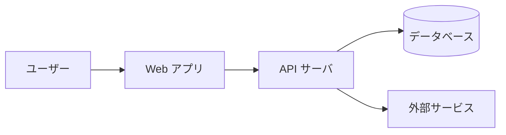
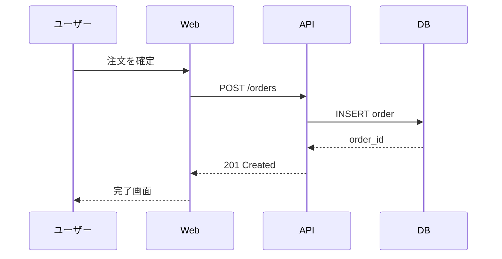

# 仕様書テンプレート集

**ドキュメントタイプ別の具体テンプレ**を集約。README / ADR / 用語集 / C4 / 簡易図 / HTML 補足ページなど、特定タイプを書くときの雛形。

既存プロジェクトに踏襲すべきスタイルがある場合は SKILL.md の「Step 1: 読み手と既存状態を確認」に従って **既存ファイルからコピー** すること。本テンプレは「ゼロから始めるとき」用。

## 関連ファイル

| ファイル | 役割 |
|---|---|
| **本ファイル** | ドキュメントタイプ別の具体テンプレ（README / ADR / 用語集 / C4 / Mermaid / HTML 補足） |
| [skeletons.md](./skeletons.md) | ドキュメント 1 枚の全体スケルトン（TL;DR / Context / Goals 構造） |
| [adr-format.md](./adr-format.md) | ADR の形式選択基準・Status 遷移・運用ルール |

---

## md テンプレート

### README.md

```markdown
# [プロジェクト名]

> 1〜2 文でシステムの目的を説明

## これは何か

このシステムが解決する課題を 3〜5 行で。誰のためのものか、何ができるか。

## アーキテクチャ概要

[C4 Level 1 図へのリンク]

主要コンポーネント:

- **コンポーネント A**: 役割
- **コンポーネント B**: 役割

## 開発を始める

### 前提

- 必要なツール、バージョン

### セットアップ

\`\`\`bash
# コマンドをそのまま貼れる形で
\`\`\`

### よくあるトラブル

- 症状 → 対処

## 運用

### 環境
- **開発環境**: [URL] / 認証: [SSO / 個別アカウント]
- **ステージング**: [URL] / 認証: [...]
- **本番**: [URL] / 認証: [...]

### 環境変数・シークレット

| 変数 | 用途 | 取得方法 |
|---|---|---|
| `DATABASE_URL` | DB 接続文字列 | Vault / 1Password / etc |
| `API_KEY` | 外部 API キー | 同上 |

### 監視・ダッシュボード

- **APM**: [Datadog / NewRelic / Grafana の URL]
- **ログ**: [CloudWatch / Loki / Elasticsearch の URL]
- **アラート**: [PagerDuty / Opsgenie / Slack channel]

### SLO・パフォーマンス目標

- 可用性: 99.X%
- レスポンスタイム p95: < NNN ms

### オンコール・障害連絡先

- **オンコール**: [PagerDuty schedule / Slack channel]
- **エスカレーション**: [連絡先]
- **障害対応 runbook**: [runbook/ へのリンク]

## ドキュメント

- [アーキテクチャ](./architecture/)
- [ADR 一覧](./adr/)
- [用語集](./glossary.md)
- [API 仕様](./specs/api/)

## 連絡先

担当チーム、Slack チャンネルなど
```

### ADR テンプレート（Nygard 形式 — シンプル版）

```markdown
# ADR-NNNN: [決定のタイトル（命令形で短く）]

## Status

提案中 / 承認 / 廃止 / 置き換え（→ ADR-XXXX）

## Context

何を決める必要があったか。背景となる事実、制約、組織的要因。

## Decision

何を決めたか。

## Consequences

この決定によって何が起きるか（良いことも悪いことも正直に）。
```

### ADR テンプレート（MADR 形式 — 構造化版）

```markdown
# ADR-NNNN: [決定のタイトル（命令形で短く）]

## ステータス

提案中 / 承認 / 廃止 / 置き換え（→ ADR-XXXX）

## 日付

YYYY-MM-DD

## コンテキストと課題

何を決める必要があったか。背景となる事実、制約、組織的要因。
ここで読者が「なぜこの決定が必要だったか」を理解できるように書く。

## 検討した選択肢

- 選択肢 A: 概要
- 選択肢 B: 概要
- 選択肢 C: 概要

## 決定

選択肢 X を採用する。

## 理由

なぜそれを選んだか。判断基準と各選択肢の評価。

## 結果（Consequences）

**ポジティブな影響:**

- ...

**ネガティブな影響・トレードオフ:**

- ...

**フォローアップで決める必要があること:**

- ...

## 関連

- 関連 ADR: ADR-XXXX
- 関連ドキュメント: ...
```

**重要**: ADR で最も価値があるのは「結果（Consequences）」セクション。デメリットやトレードオフを正直に書くこと。これが将来の保守者への最大の贈り物になる。Nygard / MADR の選択基準は [adr-format.md](./adr-format.md) を参照。

### 用語集テンプレート

```markdown
# 用語集

プロジェクト内で頻出する用語の定義。同義語・略語もここで統一する。

## ビジネス用語

### 注文（Order）

顧客がシステム上で確定させた購入意思のこと。

- 状態: pending / confirmed / shipped / delivered / cancelled
- 関連: カート（Cart）は確定前、注文は確定後

### カート（Cart）

購入確定前の商品リスト。

- 「ショッピングカート」「買い物かご」も同義で使われるが、コード・ドキュメント上は「Cart」で統一

## 技術用語

### 認証（Authentication）

ユーザーが本人であることを確認する処理。本プロジェクトでは JWT を使用。

- 認可（Authorization）とは区別する

### 認可（Authorization）

認証済みユーザーが特定の操作を行う権限を持つかの確認処理。

## 略語

| 略語 | 正式名称 | 説明 |
|------|---------|------|
| ADR | Architecture Decision Record | 設計判断記録 |
| SLA | Service Level Agreement | サービス品質保証 |
```

### C4 Level 1（System Context） — PlantUML

> **運用注意**: 外部 URL からの `!include` は **企業プロキシ / エアギャップ CI で失敗する** ことが多い。本番運用するときは以下のいずれかに切り替え:
> - **vendor 方式（推奨）**: `C4-PlantUML` リポジトリを `docs/c4/` 等に vendor / submodule して `!include ./c4/C4_Context.puml` でローカル参照
> - **キャッシュ方式**: 初回のみ外部 URL から取得して CI キャッシュに保持、以降はキャッシュ参照
> - **ミラー方式**: 社内 Artifact Repository（Nexus / Artifactory 等）にミラーを置き、`!include` 先をミラー URL に
>
> 以下のテンプレは「初学者向けに最短で動くもの」として外部 URL include を使用しているが、運用に乗せる前に上記方式へ切り替えること。

```plantuml
@startuml
!include https://raw.githubusercontent.com/plantuml-stdlib/C4-PlantUML/master/C4_Context.puml

title System Context: [システム名]

Person(user, "エンドユーザー", "このシステムを使う人")
System(system, "[システム名]", "このシステムの役割を 1 行で")
System_Ext(external1, "外部システム A", "連携する外部サービス")

Rel(user, system, "[何をするか]")
Rel(system, external1, "[何を取得/送信するか]", "HTTPS/REST")

@enduml
```

### C4 Level 2（Container Diagram） — PlantUML

```plantuml
@startuml
!include https://raw.githubusercontent.com/plantuml-stdlib/C4-PlantUML/master/C4_Container.puml

title Container Diagram: [システム名]

Person(user, "ユーザー")

System_Boundary(system, "[システム名]") {
    Container(web, "Web アプリ", "React", "ユーザーインターフェース")
    Container(api, "API サーバ", "Node.js", "ビジネスロジック")
    ContainerDb(db, "データベース", "PostgreSQL", "永続化")
}

Rel(user, web, "利用", "HTTPS")
Rel(web, api, "API 呼び出し", "JSON/HTTPS")
Rel(api, db, "読み書き", "SQL/TCP")

@enduml
```

### 簡易フロー（Mermaid）



### シーケンス図（Mermaid）



---

## HTML 補足テンプレート

HTML 補足ページは **サマリー / 概況 / 比較・対比 / 配色で意味を伝える表** など、視覚情報が主役のページに限定して使う。視覚設計の判断は `dashboard-design` スキルを必ず参照すること。

### 採用パターン

| 状況 | 採用するパターン |
|---|---|
| HTML 補足ページが **1 本のみ**（単発） | 本ファイルの最小骨格。`<style>` 内に最小装飾を直書きしてよい |
| HTML 補足ページが **2 本以上 or 増える見込み** | 共通 CSS 集約型。[`html-css-centralization.md`](./html-css-centralization.md) を必ず参照し、`<link>` で共通 CSS を参照し各 HTML の `<style>` は `:root` 固有変数のみに収める |

以下のサマリー / 比較ページ骨格は **共通 CSS 集約型** で示す（複数ページ前提の推奨パターン）。単一 HTML の場合は `<link>` 参照を外して `<style>` 内に必要装飾を直書きしてよい。

### サマリーページの最小骨格（共通 CSS 集約型）

```html
<!DOCTYPE html>
<html lang="ja">
<head>
  <meta charset="UTF-8">
  <title>[システム名] サマリー</title>
  <link rel="preconnect" href="https://fonts.googleapis.com">
  <link rel="preconnect" href="https://fonts.gstatic.com" crossorigin>
  <link rel="stylesheet" href="https://fonts.googleapis.com/css2?family=Inter:wght@400;500;600&family=Noto+Sans+JP:wght@400;500;600&family=JetBrains+Mono:wght@400;500&display=swap">
  <link rel="stylesheet" href="../_shared/spec-page.css">
  <style>
    /* ===== summary.html 固有 CSS 変数のみ =====
     * その他のスタイルは ../_shared/spec-page.css の body.page-summary scope に集約。
     */
    :root {
      --kpi-positive: #059669;
      --kpi-positive-bg: #d1fae5;
      --kpi-warn: #d97706;
      --kpi-warn-bg: #fef3c7;
    }
  </style>
</head>
<body class="page-summary">
  <header class="page">
    <p class="breadcrumb"><a href="../">Docs</a> / Summary</p>
    <h1>[システム名]: 全体サマリー</h1>
    <p class="subtitle">このページで何が分かるかを 1 行で</p>
  </header>

  <main>
    <section>
      <div class="tldr">
        <span class="label">TL;DR</span>
        主要指標と現状サマリーを 2〜3 行で
      </div>
    </section>

    <section>
      <h2>主要指標</h2>
      <!-- ページ固有レイアウト .summary-grid / .card は共通 CSS の
           body.page-summary scope で定義する -->
      <div class="summary-grid">
        <div class="card">
          <h3>主要指標 1</h3>
          <div class="value">123</div>
        </div>
        <div class="card">
          <h3>主要指標 2</h3>
          <div class="value">45%</div>
        </div>
      </div>
    </section>

    <footer class="page">
      <nav class="page-nav">
        <div>
          <span class="label-row">前のページ</span>
          <a href="./overview.html">概要</a>
        </div>
        <div>
          <span class="label-row">次のページ</span>
          <a href="./detail-a.html">詳細 A</a>
        </div>
      </nav>
    </footer>
  </main>
</body>
</html>
```

共通 CSS 側（`_shared/spec-page.css`）には以下を `body.page-summary` scope で追加する:

```css
body.page-summary .summary-grid {
  display: grid;
  grid-template-columns: repeat(auto-fit, minmax(240px, 1fr));
  gap: 16px;
}

body.page-summary .card {
  background: var(--surface);
  padding: 16px;
  border-radius: 8px;
  border: 1px solid var(--border);
}

body.page-summary .card h3 {
  margin: 0 0 8px;
  font-size: 14px;
  color: var(--muted);
  text-transform: uppercase;
  letter-spacing: 0.04em;
}

body.page-summary .card .value {
  font-size: 28px;
  font-weight: 600;             /* Vercel display ceiling = 600 (700 へ昇格しない) */
  color: var(--text);
}
```

### 比較・対比ページの最小骨格（共通 CSS 集約型）

```html
<!DOCTYPE html>
<html lang="ja">
<head>
  <meta charset="UTF-8">
  <title>[項目] 比較</title>
  <link rel="stylesheet" href="https://fonts.googleapis.com/css2?family=Inter:wght@400;500;600&family=Noto+Sans+JP:wght@400;500;600&family=JetBrains+Mono:wght@400;500&display=swap">
  <link rel="stylesheet" href="../_shared/spec-page.css">
  <style>
    /* ===== compare.html 固有 CSS 変数のみ ===== */
    :root {
      --verdict-yes: #15803d;
      --verdict-no: #b91c1c;
      --verdict-partial: #6b7280;
    }
  </style>
</head>
<body class="page-compare">
  <header class="page">
    <p class="breadcrumb"><a href="../">Docs</a> / Compare</p>
    <h1>[項目] の比較</h1>
    <p class="subtitle">何を判断するための比較表か（読み手のための 1 行）</p>
  </header>

  <main>
    <section>
      <table class="compare zebra">
        <thead>
          <tr>
            <th>観点</th>
            <th>選択肢 A</th>
            <th>選択肢 B</th>
            <th>選択肢 C</th>
          </tr>
        </thead>
        <tbody>
          <tr>
            <td>導入コスト</td>
            <td><span class="verdict yes">低</span></td>
            <td><span class="verdict partial">中</span></td>
            <td><span class="verdict no">高</span></td>
          </tr>
          <!-- 色だけで分類せず、テキスト（低/中/高）と色の二重符号化 -->
        </tbody>
      </table>

      <p><strong>結論</strong>: ... （比較から得られる推奨を 1〜2 行）</p>
    </section>
  </main>
</body>
</html>
```

共通 CSS 側に `body.page-compare` scope で:

```css
body.page-compare table.compare {
  width: 100%;
}

body.page-compare .verdict.yes {
  color: var(--verdict-yes);
  font-weight: 600;             /* Vercel display ceiling = 600 */
}

body.page-compare .verdict.no {
  color: var(--verdict-no);
  font-weight: 600;             /* Vercel display ceiling = 600 */
}

body.page-compare .verdict.partial {
  color: var(--verdict-partial);
}
```

**注意**:
- HTML 補足ページの配色・コントラスト比・色数制約・装飾排除・アクセシビリティの詳細は `dashboard-design` スキル + [`dashboard-design/references/visual-encoding.md`](../../dashboard-design/references/visual-encoding.md) を参照
- 共通 CSS の最小骨格・`:root` 変数命名規則・ページ別 scope の書き方・段階的移行手順は [`html-css-centralization.md`](./html-css-centralization.md) を参照
- 単一 HTML 完結で書きたい場合は `<link>` 参照を外し、上記の `body.page-X scope` で示した CSS を `<style>` 内にインライン展開してよい
